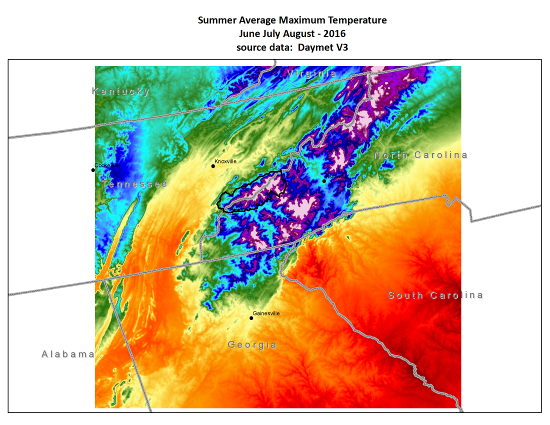

# Python Methods to Derive a Seasonal Mean from Daymet Data - Reading/Writing netCDF

*Author: Michele Thornton*
*Date: February 28, 2018*
*Contact for ORNL DAAC: uso@daac.ornl.gov

### Keywords: Daymet, Python, netCDF, THREDDS

## Overview

This tutorial demonstrates how to use the Python netCDF4 and numpy modules to work with a dataset in netCDF file format using N-dimensional array objects. Introductory Python numpy array methods are shown that open and subset a temporal range from a gridded multidimentional netCDF file. The example uses data from the maximum temperature variables of a dataset (Daymet) that contain daily gridded meteorologic data. A summer average maximum temperature is created and the results saved into a new netCDF file. This is part one of a two part tutorial. The follow-on tutorial condenses introductory information and demonstates how to loop through more than one year of data. 

## Source Data

Spatial subsests of the North American Daymet dataset daily data; https://daymet.ornl.gov. For this example, spatial subsets were obtained from the ORNL DAAC's THREDDS netCDF Subset Service (NCSS). A tutorial of the NCSS is available here: https://daymet.ornl.gov/web_services.html. 
The sample input data were uploaded to the github site using the Git Large File Storage (LFS) utility. If you'd like to work with these sample data, you can download the files from git by clicking directly on the file names in the //indata path and clicking on the "Download" button provided in the Git page.

## Prerequisites

Python 2.7 or later. Python modules: netCDF4, numpy, matplotlib